# Day 7: Advanced Scheduling & Node Management (Spring Boot Edition)

## 🎯 Goal
Control exactly where your workloads run using **Taints, Tolerations, and Node Affinity**. We will use a custom **Spring Boot** application for this lab.

## 🏗️ Prerequisites
1.  **Build the Docker Image**:
    Since we are using k3s/local k8s, we need to build the image so it's available to the cluster.
    ```bash
    cd day7
    docker build -t spring-boot-k8s:v1 .
    # IMPORTANT: If using k3d, you must import the image:
    k3d image import spring-boot-k8s:v1 -c k8s-class
    ```
    *Note: If using k3s, you might need to import the image or use a local registry. For standard Docker Desktop Kubernetes, the local build is sufficient.*

2.  **Deploy the App**:
    ```bash
    kubectl apply -f k8s/deployment.yaml
    kubectl apply -f k8s/service.yaml
    ```

3.  **Verify**:
    ```bash
    kubectl get pods -l app=spring-boot-k8s
    # Forward port to test
    kubectl port-forward svc/spring-boot-k8s 8080:80
    # Visit http://localhost:8080/hello
    ```

## 🧪 Lab: Mastering Scheduling

### Part 1: Taints & Tolerations (Node-centric)
**Concept**: Taints are like "repellent" sprays. They repel Pods unless the Pod has a specific immunity (Toleration).

#### Architecture Diagram


```mermaid
graph TD
    subgraph Cluster
    N1[Node 1: Tainted 'env=prod']:::tainted
    N2[Node 2: Untainted]:::normal
    
    P1(Pod A: No Toleration):::pod -->|🚫 Blocked| N1
    P1 -->|✅ Scheduled| N2
    
    P2(Pod B: Tolerates 'env=prod'):::pod -->|✅ Scheduled| N1
    end
    
    classDef tainted fill:#ffcccc,stroke:#ff0000,stroke-width:2px;
    classDef normal fill:#ccffcc,stroke:#00ff00,stroke-width:2px;
    classDef pod fill:#ccccff,stroke:#0000ff;
```

**Scenario**: You have a "Production" node and don't want random dev pods landing on it.

1.  **Taint a Node**:
    Pick a node name from `kubectl get nodes`.
    ```bash
    kubectl taint nodes <node-name> env=prod:NoSchedule
    ```

2.  **Try to Schedule a Pod**:
    Deploy a standard Nginx pod (or use `k8s/pod-taint.yaml` *without* uncommenting the tolerations).
    ```bash
    kubectl apply -f k8s/pod-taint.yaml
    ```
    **Result**: The pod stays in `Pending` state. Check why:
    ```bash
    kubectl describe pod pod-taint-test
    # Message: "0/1 nodes are available: 1 node(s) had taint {env: prod}, that the pod didn't tolerate."
    ```

3.  **Add a Toleration**:
    Edit `k8s/pod-taint.yaml` and uncomment the `tolerations` section.
    ```bash
    kubectl apply -f k8s/pod-taint.yaml
    ```
    **Result**: The pod now schedules successfully!

4.  **Clean up**:
    ```bash
    kubectl taint nodes <node-name> env-
    kubectl delete pod pod-taint-test
    ```

### Part 2: Node Affinity (Pod-centric)
**Concept**: Node Affinity is like a "magnet". It attracts Pods to specific Nodes based on labels.

#### Architecture Diagram


**Scenario**: The Spring Boot app requires High CPU nodes.

1.  **Label a Node**:
    ```bash
    kubectl label nodes <node-name> hardware=high-cpu
    ```

2.  **Update Deployment**:
    Edit `k8s/deployment.yaml` and add `nodeAffinity` under `spec.template.spec`:
    ```yaml
    affinity:
      nodeAffinity:
        requiredDuringSchedulingIgnoredDuringExecution:
          nodeSelectorTerms:
          - matchExpressions:
            - key: hardware
              operator: In
              values:
              - high-cpu
    ```
    *Note: Indentation is critical! Check Kubernetes docs for exact placement.*

3.  **Apply and Watch**:
    ```bash
    kubectl apply -f k8s/deployment.yaml
    ```
    The pods will restart and be scheduled *only* on the labeled node.

4.  **Verify**:
    ```bash
    kubectl get pods -o wide
    ```

## 🧹 Cleanup
1.  **Delete Resources**:
    ```bash
    kubectl delete -f k8s/ --ignore-not-found=true
    ```
    *Note: The `--ignore-not-found` flag prevents errors if you've already deleted some pods manually.*

2.  **Remove Node Labels**:
    ```bash
    kubectl label nodes k3d-k8s-class-agent-1 hardware-
    ```

